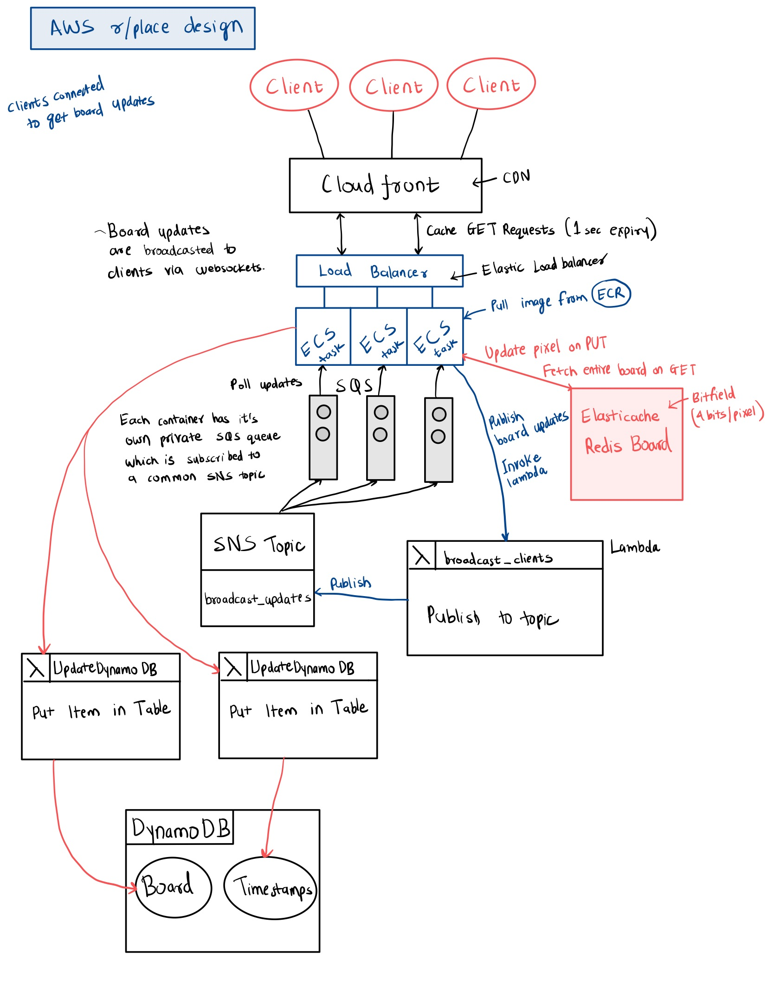

## AWS Tools and Interactions

- **CloudFront:** 
  - Amazon CloudFront is used as a content delivery network (CDN) to serve the content via a global network of edge locations, providing low latency data delivery. It uses two origins to handle both frontend and API requests and enable efficient edge caching of both static content and board states. 
  - As the web app is static, edge-caching utilizes Amazon’s extensive content delivery network to greatly reduce latency, irrespective of location. 
  - Fetching the board state from the API is also a frequently employed operation with high volume. This is also edge-cached with a TTL of a few seconds (configurable based on volume) after which the board is fetched from the API and cached again. 
- **Simple Storage Service (S3):** S3 is an object storage service offering industry-leading scalability, data availability, security, and performance. An S3 bucket is used to host our static web app files served by the CDN. This bucket is private and only handles requests received through Cloudfront.
- **Elastic Load Balancer**: An Elastic Load Balancer (ELB) is used to distribute incoming network traffic across an AWS Fargate cluster with Services running. This ensures no single instance is overwhelmed, improving the reliability of the application.
- **Fargate**: A serverless compute engine for containers that works with Amazon ECS. Fargate eliminates the need to provision and manage servers, allowing the system to automatically scale the compute capacity. This allows the system to get the best of both cost-efficiency and performance as the system can automatically scale up or down based on demand. 
- **Elastic Container Service (ECS)**: 
  - A fully managed container orchestration service that facilitates the deployment, management, and scaling of containerized applications. Containers host some application logic, managing and broadcasting pixel updates, and communicating with other services. 
  - ECS pulls the image from ECR, which can be updated without downtime.
- **Lambda Functions**: A serverless compute service that executes code in response to events, broadcasting updates to clients. 
  - `broadcast_clients` handles forwarding board state updates to SNS for publishing to distributed ECS containers and clients.
  - `updateDynamoDB` handles updating board state and user request timestamps
  - Offloading expensive tasks to lambda functions allows efficient asynchronous request handling, allowing expensive tasks to be handled with resources auto-scaled.
- **Simple Notification Service (SNS)**: Manages the publish-subscribe (pub/sub) messaging for microservices, distributed systems, and serverless applications. An SNS topic publishes board state updates to all subscribers. Publishes pixel updates to a topic that triggers a Lambda function. 
- **Simple Queue Service (SQS)**: Queues that decouple container instances from the board update and broadcast process, ensuring reliability. Each ECS task creates its own private SQS queue which is subscribed to the common SNS topic. Once a PUT request arrives from any of the clients, a lambda function is triggered to publish to the SNS topic. As a result of this, every ECS task gets this update which is sent to the client via a websocket connection instantly.

- **Elasticache**: 
  - Provides an in-memory Redis data store in the cloud to use as a caching layer for the board, providing fast read/write operations. As getting board state is a common operation, this greatly hastens retrieval times. Board update times are also rapid as the board is represented as a bitfield. 
  - ElastiCache automatically accommodates the workload traffic as it ramps up or down. For each ElastiCache Serverless cache, ElastiCache continuously tracks the utilization of resources such as CPU, memory, and network. When any of these resources are constrained, ElastiCache scales out by adding a new shard and redistributing data to the new shard, without any downtime to the application. 
  - The board is stored as a bitfield with each pixel being 4 bits. Requests to retrieve the entire Redis board (when not cached) take around 300ms, making it comparable to the actual r/place implementation.

- **DynamoDB**: 
  - This serverless NoSQL database service is used for storing board state and timestamps, ensuring data persistence. It scales to support tables of virtually any size with automated horizontal scaling. 
  - Availability, durability, and fault tolerance are built-in, eliminating the need to further architect for these capabilities. Offers single-digit millisecond performance and up to 99.999% availability.
  - This acts as a failover and facilitates disaster recovery.
- **Cloudwatch:** By collecting data across AWS resources, CloudWatch gives visibility into system-wide performance and allows users to gain a unified view of operational health, react to changes automatically and optimize resource usage.
- **CloudFormation**: Automates and manages the infrastructure as code, allowing for reproducible and consistent environments through a constructed template file.
- **Identity and Access Management (IAM):** Manages access to AWS services and resources securely, providing fine-grained access control. Used to create and manage developer accounts, roles, and permissions.

## Design Rationale and Strengths

- **Vertical Scalability**: By using services like ECS and Elasticache, the system can scale up by adding more computational power or memory to the individual instances or nodes. Fargate also allows each container to use the right amount of compute, enabling the system to scale up as needed without provisioning extra servers.
- **Horizontal Scalability**: Load Balancer, ECS, and DynamoDB are designed to seamlessly add more resources as needed. With AWS Fargate and SQS, the system can scale both the application and the messaging layer effectively to handle variable loads. It also allows the system to scale out by adding more Fargate tasks to manage increased load, thus enhancing the system's ability to handle more users and updates concurrently. 
- **Security**: IAM allows precise control over who can access what resources in the AWS environment, enhancing the system's security posture. Data in transit is encrypted via CloudFront. Services are accessible only within the same VPC. Security groups are configured such that resources are only accessible by services that need them.
- **Manageability**: CloudFormation automates the deployment and management of the infrastructure, making it easier to replicate and maintain.
- **Reliability and Durability**: Reliability and durability are embedded at every layer. 
  - SQS adds message durability, ensuring that no update is lost even if a component fails, thus increasing the overall reliability of the system.
  - Elasticache & DynamoDB make strong consistency and availability guarantees.
  - Resources are configured to be available in multiple availability zones, providing greater availability and disaster recovery.
- **Decoupling**: 
  - SQS queues enable the decoupling of the ECS containers from the SNS topics.
  - Expensive operations like DynamoDB sets are decoupled through lambdas.
  - Elastic load balancer and ECS through Fargate autoscale independently
  - Storage layer is also decoupled to Elasticache and DynamoDB.
  - All these allow for independent scaling and improves the system's resilience. 	

- **Why not just make it fully serverless?** 
  - We also experimented with a fully serverless design using lambdas, and found the lambda latency to not be as fast as using ECS. On an average, the lambda took around 800ms just to connect with the Elasticache cluster while our ECS solution completed the request in ~300ms.
  - Additionally, in order to handle broadcast of board updates to clients through lambdas, we would have to store and manually iterate through connection IDs as lambdas and APIGateway do not support a concurrent websocket broadcast.
    - We could potentially parallelize this operation by invoking multiple lambdas in parallel, but this would add further latency.
  - Instead ECS containers scale on demand and are low-latency.
  - SQS/SNS are key to ensure this distributed, scalable broadcasting is possible.
    - Using this approach, each ECS task just handles its own set of clients concurrently.
- **Low latency:** Aside from the aforementioned reason, multi-level caching also guarantees very low latency and high throughput.
  - L1 caching at the CDN layer caches both static content and board state. Board state is invalidated every few seconds (configurable TTL) to ensure the latest board is available.
  - L2 caching using Elasticache/Redis to store the board ensures ultra-fast retrieval and updates of the board.
  - *All this makes our app provide better or comparable(at worst) latency to Reddits’ original r/place design, with response latency ranging from 60-300ms.*
- **Spam Protection**: To prevent spam, we only allow a single user to color a board tile once every 5 minutes.

## Weaknesses

- **Cost Management:** Monitoring and managing costs become more challenging as more AWS services are utilized, especially with the serverless components which can scale rapidly. For instance, while it is cost-effective at scale, Fargate can be expensive for small workloads because of its pricing model based on the compute and memory resources that the containerized application requests.
- **Vendor Lock-in and Portability**: As the system is deeply integrated with AWS-specific services, moving to another cloud provider or an on-premises environment would be challenging.
- **User authentication:** As this was not a focus area, effort was not made to employ a user authentication system. Client-generated temporary session IDs are used as a unique identifier. This leaves it vulnerable to DDoS attacks.